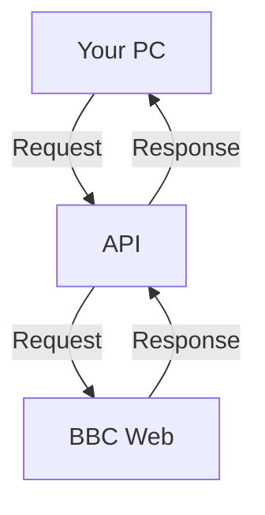

# [BBC News API](https://bbc-news-api.vercel.app/info)
## BBC
BBC, British Broadcasting Corporation is a Trustable News Site. It has coverage of more than 40 languages. 

## API
Application Programming Interface(API) is a way for two or more computer programs to communicate with each other. It is a type of software interface, offering a service to other pieces of software. A document or standard that describes how to build or use such a connection or interface is called an API specification.

## What is this API?
BBC News API is the API for serving the news from all the BBC Services according to your need. This API has a coverage of 29 Language! The other Languages API is under development! Track our Workflow at [BBC API Project](https://github.com/users/Sayad-Uddin-Tahsin/projects/3).
### How it works?


## Endpoints
### URL Formation: `https://bbc-api.vercel.app/<language>/<type>`

Types & Languages are in [Endpoints.md](https://github.com/Sayad-Uddin-Tahsin/BBC-Bangla-API/blob/main/Endpoints.md)

All the modules are mentioned with versions in [requirements.txt](https://github.com/Sayad-Uddin-Tahsin/BBC-Bangla-API/blob/main/requirements.txt). You can use `pip install -r requirements.txt` after cloning the Repository, this will automatically install all the Modules mentioned/needed!

## How to use?
Fetch our API URL with `GET` HTTP method! You can use any programming language to use our API. Here are code examples, how you can use our API in different language.

### Python
```py
# pip install requests
import requests

response = requests.get("https://bbc-news-api.vercel.app/bengali/news").json()
print(response)
```

**NOTE: IF ANY ERROR ENCOUNTERED, FEEL FREE TO CREATE AN [ISSUE](https://github.com/Sayad-Uddin-Tahsin/BBC-Bangla-API/issues)**

## The response looks so messy?
The response is received in `json` format. So, it might look a bit messy but don't worry, just `Paste` the response in [Json Formatter](https://jsonformatter.curiousconcept.com/#) and press `Process`, it will show you a nice structured result!

In your code, you can get the `value` by calling the `key`. 
```json
{"key": "value"}
```

> ***Don't forget to give a star on this repository!***

**Thank you**
