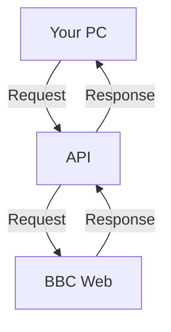

<p align="center">
    <a href="https://bbc-api.vercel.app"><picture><source media="(prefers-color-scheme: dark)" srcset="https://raw.githubusercontent.com/Sayad-Uddin-Tahsin/BBC-News-API/main/Assets/Dark%20Logo.png"></picture></a>
</p>

# BBC News API
Discover the world of news through the lens of the BBC News API. With access to a rich array of news content spanning over 31 languages, this API serves as a gateway to the latest updates from the British Broadcasting Corporation (BBC). Seamlessly integrate trusted news sources into your applications, offering users a diverse and comprehensive view of current events. Empower your audience with timely and reliable information, curated by one of the most respected news organizations worldwide.

<a href="https://bbc-api.vercel.app"></a>
<a href="https://bbc-api.vercel.app"></a>
<a href="https://bbc-api.vercel.app"></a>
<a href="https://bbc-api.vercel.app"></a>

<picture><source media="(prefers-color-scheme: dark)" srcset="https://web-badge-psi.vercel.app/visit-badge?theme=dark"></picture>
<picture><source media="(prefers-color-scheme: dark)" srcset="https://web-badge-psi.vercel.app/latency-badge?theme=dark"></picture>

## BBC
BBC, British Broadcasting Corporation is a Trustable News Site. It has coverage of 31 languages. 

## API
Application Programming Interface (API) is a way for two or more computer programs to communicate with each other. It is a type of software interface, offering a service to other pieces of software. A document or standard that describes how to build or use such a connection or interface is called an API specification.

## What is this API?
BBC News API is the API for serving the news from all the BBC Services according to your need. This API has a coverage of 31 Languages!

### How it works?


## Documentation
The official BBC News API documentation can be found [here](http://bbc-api.vercel.app/documentation)

## Endpoints
URL Formation: `https://bbc-api.vercel.app/<type>?lang=<language>`

Types & Languages are in [Endpoints.md](https://github.com/Sayad-Uddin-Tahsin/BBC-Bangla-API/blob/main/Endpoints.md)

## Wrapper
### [bbc-news](https://pypi.org/project/bbc-news) for Python

<a href="https://pypi.org/project/bbc-news"></a>
<a href="https://pypi.org/project/bbc-news"></a>
<a href="https://python.org"></a>

The `bbc-news` Python wrapper provides convenient access to the BBC News API from your Python projects. It allows you to easily fetch news content and integrate it into your applications. You can install the wrapper via pip:

```sh
pip install bbc-news
```
Example usage in Python: [Quick start with bbc-news](https://github.com/Sayad-Uddin-Tahsin/BBC-News-API/blob/main/bbc/BBC-News-Wrapper.md#quick-start)

## How to use?
Fetch our API URL with `GET` HTTP method! You can use any programming language to use our API. Here are code examples, how you can use our API in different language.

<!-- Python -->
<details open>
<summary><b>Python</b></summary>


<details open>
<summary>With Wrapper</summary>

```python
# pip install bbc-news

# Import the Library
import bbc

# Get the News for Bengali
news = bbc.news.get_news(bbc.Languages.Bengali)

# Get the Category Titles
categories = news.news_categories()

# Loop through the category titles
for category in categories:
    # Get the Category News
    section_news = news.news_category(category)

    # Loop through the news dictionary
    for news_dict in section_news:
        # Print the Title
        print(news_dict['title'])

        # Print the Image Link
        print(news_dict['image_link'])

        # Print the News Link
        print(news_dict["news_link"])
                
        # Print a Separator Line
        print("---")

```

</details>


<details>
<summary>With requests</summary>

```py
# pip install requests
import requests

response = requests.get("https://bbc-api.vercel.app/news?lang=bengali").json()
print(response)
```

</details>
</details>

<!-- JavaScript (Node.js) -->
<details>

<summary>JavaScript (Node.js)</summary>

```js
const axios = require('axios');

axios.get('https://bbc-api.vercel.app/news?lang=chinese')
  .then(response => {
    console.log(response.data);
  })
  .catch(error => {
    console.log(error);
  });
```
    
</details>

<!-- JavaScript (Browser) -->
<details>

<summary>JavaScript (Browser)</summary>

```py
fetch('https://bbc-api.vercel.app/news?lang=turkish')
  .then(response => response.json())
  .then(data => console.log(data))
  .catch(error => console.log(error));
```
    
</details>

<!-- PHP -->
<details>

<summary>PHP</summary>

```php
$response = file_get_contents('https://bbc-api.vercel.app/news?lang=spanish');
$data = json_decode($response);
print_r($data);
```
    
</details>

<!-- Ruby -->
<details>

<summary>Ruby</summary>

```ruby
require 'net/http'
require 'json'

uri = URI('https://bbc-api.vercel.app/news?lang=portuguese')
response = Net::HTTP.get(uri)
data = JSON.parse(response)
puts data
```
    
</details>

<!-- Java -->
<details>

<summary>Java</summary>

```java
import java.net.HttpURLConnection;
import java.net.URL;
import java.util.Scanner;

public class Main {
    public static void main(String[] args) {
        try {
            URL url = new URL("https://bbc-api.vercel.app/news?lang=russian");
            HttpURLConnection conn = (HttpURLConnection) url.openConnection();
            conn.setRequestMethod("GET");
            conn.connect();
            int responseCode = conn.getResponseCode();
            if (responseCode == 200) {
                Scanner scanner = new Scanner(url.openStream());
                String responseBody = scanner.useDelimiter("\\A").next();
                scanner.close();
                System.out.println(responseBody);
            }
        } catch (Exception e) {
            e.printStackTrace();
        }
    }
}
```
    
</details>

**NOTE: IF ANY ERROR ENCOUNTERED, FEEL FREE TO CREATE AN [ISSUE](https://github.com/Sayad-Uddin-Tahsin/BBC-Bangla-API/issues)**

## The response looks so messy?
The response is received in `json` format. So, it might look a bit messy but don't worry, just `Paste` the response in [Json Formatter](https://jsonformatter.curiousconcept.com/#) and press `Process`, it will show you a nice structured result!

<details>

<summary>Raw Response</summary>

```json
{
   "status":200,
   "latest":{
      "title":"习近平与普京会晤：这场中俄元首会谈预料将带来什么？",
      "news_link":"https://www.bbc.com/zhongwen/simp/world-65011228",
      "image_link":"https://ichef.bbci.co.uk/news/640/cpsprodpb/1124F/production/_129032207_70993ea9-6b3a-47f8-ad2e-fb9056891843.jpg"
   },
   "Top story - Zhongwen":[
      {
         "title":"台积电赴德国设厂：为何引发台湾与欧盟“晶片外交”争议",
         "news_link":"https://www.bbc.com/zhongwen/simp/business-65010920",
         "image_link":"https://ichef.bbci.co.uk/news/640/cpsprodpb/111C9/production/_113598007_whatsubject.jpg"
      },
      {
         "title":"法国养老金抗议：一场马克龙政府注定难逃的危机？",
         "news_link":"https://www.bbc.com/zhongwen/simp/world-65011246",
         "image_link":"https://ichef.bbci.co.uk/news/640/cpsprodpb/7802/production/_129022703_parisprot.jpg"
      },
      {
         "title":"美国前总统特朗普发文称他预计将于周二被捕",
         "news_link":"https://www.bbc.com/zhongwen/simp/world-65005167",
         "image_link":"https://ichef.bbci.co.uk/news/640/cpsprodpb/97F7/production/_129030983_bcb1bb78fb380529961661a4e58750eab4235d14.jpg"
      },
      {
         "title":"国际刑事法院颁令拘捕普京，指控他犯下战争罪",
         "news_link":"https://www.bbc.com/zhongwen/simp/world-64998418",
         "image_link":"https://ichef.bbci.co.uk/news/640/cpsprodpb/F872/production/_129020636_gettyimages-1247187786.jpg"
      },
      {
         "title":"视频, 乌克兰战争：记者随军记录巴赫穆特的前线战场, 节目全长 5,53",
         "news_link":"https://www.bbc.com/zhongwen/simp/world-64991992",
         "image_link":"https://ichef.bbci.co.uk/images/ic/512xn/p0f9cl9n.jpg"
      },
      {
         "title":"“大而不倒”的瑞信股价暴跌 比硅谷银行倒闭更像“雷曼时刻”",
         "news_link":"https://www.bbc.com/zhongwen/simp/business-64976475",
         "image_link":"https://ichef.bbci.co.uk/news/640/cpsprodpb/1269B/production/_128991457_creditsuisse_reuters.jpg"
      },
      {
         "title":"中国流亡商人郭文贵在美国被控诈骗10亿美元，北京低调回应",
         "news_link":"https://www.bbc.com/zhongwen/simp/world-64985642",
         "image_link":"https://ichef.bbci.co.uk/news/640/cpsprodpb/11B84/production/_97708527_capture.jpg"
      },
      {
         "title":"视频, 台积电创办人张忠谋表态支持美国对华晶片政策 称半导体业全球化已死, 节目全长 1,42",
         "news_link":"https://www.bbc.com/zhongwen/simp/chinese-news-64987302",
         "image_link":"https://ichef.bbci.co.uk/images/ic/512xn/p0f9b064.jpg"
      }
   ],
   "elapsed time":"0.00s",
   "timestamp":1679297348
}
```

</details>

<details>

<summary>Formatted Response</summary>
    


</details>

In your code, you can get the `value` by calling the `key`. 
```json
{"key": "value"}
```
